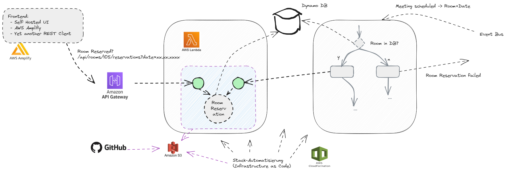

# Room Reservation

This is a small sample for a room reservation service that is implemented on top of the AWS stack. We use

 - [AWS Lambda](https://aws.amazon.com/de/lambda/) to implement the room reservation
   - core logic deployed as a layer
   - request handlers to create and find a reservation
 - [AWS S3](https://aws.amazon.com/de/s3/) to store the code
 - [AWS Dynamo DB](https://aws.amazon.com/dynamodb/) to store the reservations
 - [AWS Step Functions](https://aws.amazon.com/step-functions/) to create a small workflow to create a reservation
 - [AWS API Gateway](https://aws.amazon.com/de/api-gateway/) to provide a REST API to find a reservation
 - [AWS CloudFormation](https://aws.amazon.com/de/cloudformation/) to automate the stack creation
   ([TerraForm](https://www.terraform.io/) could be used here too)
 - [AWS CodePipeline](https://aws.amazon.com/de/codepipeline/) to have a CI/CD pipeline

The following picture shows the whole architecture:

